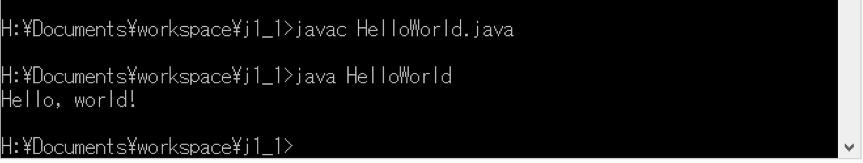
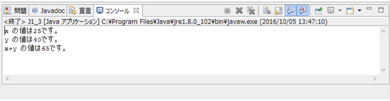
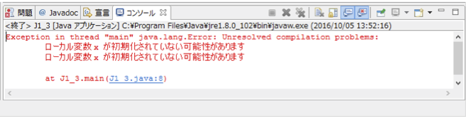

# プログラミング演習II 第1回
* 学籍番号：1764xxx
* 氏名：横浜太郎
* 所属：情報工学EP

# 課題の説明

## HelloWorld
ソースファイル：HelloWorld.java

### プログラムの説明
* "Hello, world!"を表示する`println`だけのシンプルなプログラム

### 実行結果

### 考察
* C言語の`printf`とは異なり，改行コードを末尾に書かなくても改行されている

## 課題 (J1_1)
ソースファイル：J1_1.java

### プログラムの説明
* 単純な変数の表示．変数xとyに整数値を代入して表示している．

### 実行結果

* 通常の実行結果：

* (x+y)の括弧をなくした場合：

* xに初期値を指定しない場合：

### 考察
* (x+y)の括弧をなくすと，xとyの和の働きをしていた+の記号が，文字列の連結の働きをし，2540と文字として結合した結果が表示されている．また，xに初期値を指定しないとエラーとなった．

# 参考文献
* 演習のWebサイト

# 謝辞
* 特になし
